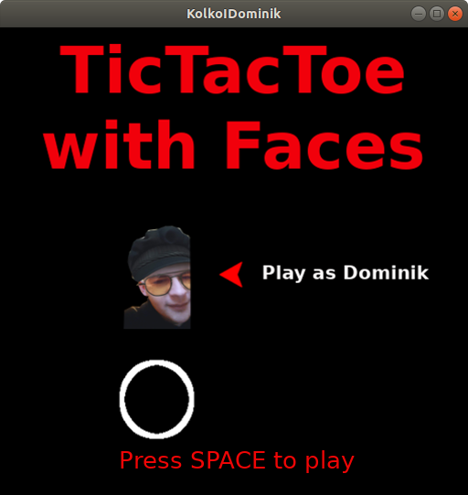
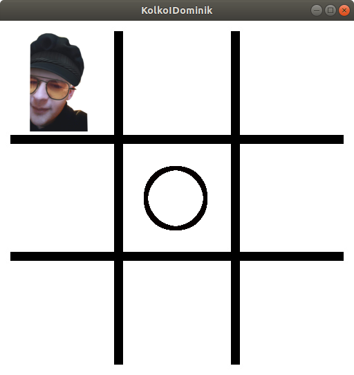
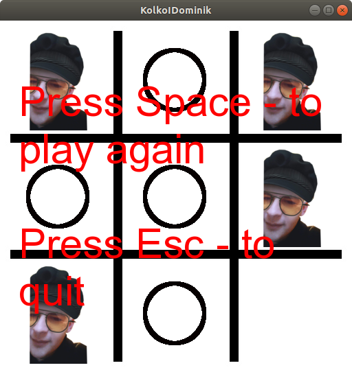

# TicTacToe-with-faces
Repository contains TicTacToe implementation in c++ using sfml and faces images instead of cross and circle with minmax algorithm to play with computer.

Some screens from game:

